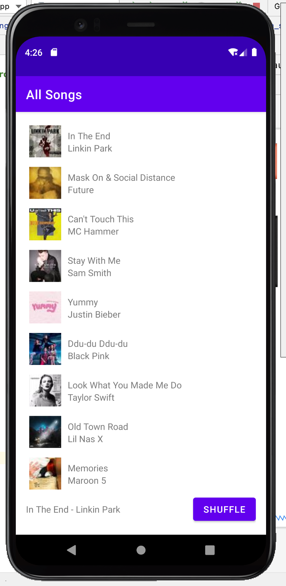

# HW2 - RecyclerView & Multiple Activities by Steven Luong
This music app can ...
- Display a list of songs
- When a song is clicked, a miniplayer shows up which shows the selected song and a shuffle button
- The shuffle button allows users to shuffle the song order of the list
- When the song name is clicked in the miniplayer, the user is navigated so the song player activity

## Extra Credit
I completed these extra credit
- #1 Displays the android back arrow button on the song player activity which navigates back to the song list when clicked

## Screenshots

