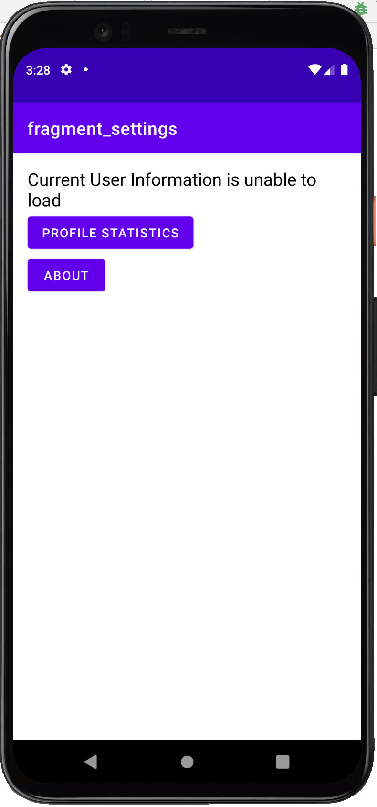
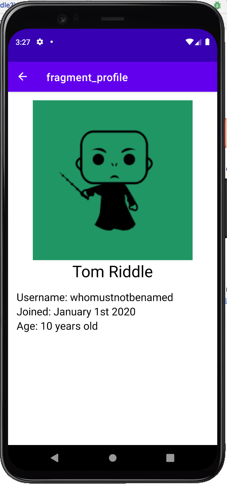

# HW3 - Application, JSON parsing & Network Requests
# By Steven Luong
This music app can ...
- Use the application class to store information
    - The song list is stored in the application class
    - when the user clicks the shuffle button, the order of songs in the list changes
- The app makes an HTTP GET request for user information
    - If the request fails, the Settings fragment will remove the visibility of the profile button and replace it with a message stating that the user info request failed
- The user info json from the GET request is parsed into a User data object
- The User Object information is displayed on the Profile fragment
- The Profile fragment also displays the image of the user using Coil

## Screenshots

