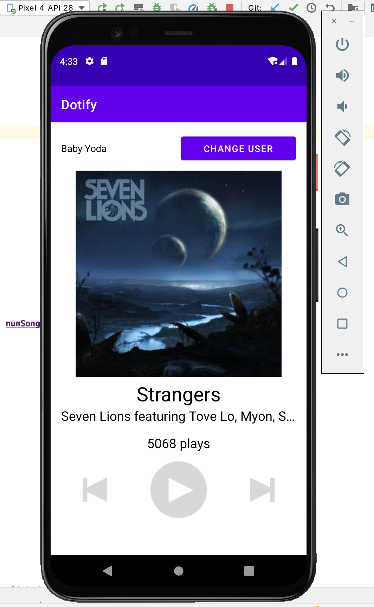

# Dotify by Steven Luong
This music app can ...
- Change the current user
- Keep track of the number of plays of the current song
- Display a toast when the previous or next button is clicked

## Extra Credit
I completed these extra credit
- #2 The song play count color toggles between black and lavendar when the cover is long clicked
- #3 A barrier is being used to separate the user name headers and the cover photo
- #4 All dimensions and colors are extraced into res/values/dimens.xml and res/values/colors.xml respectively
## Screenshots

