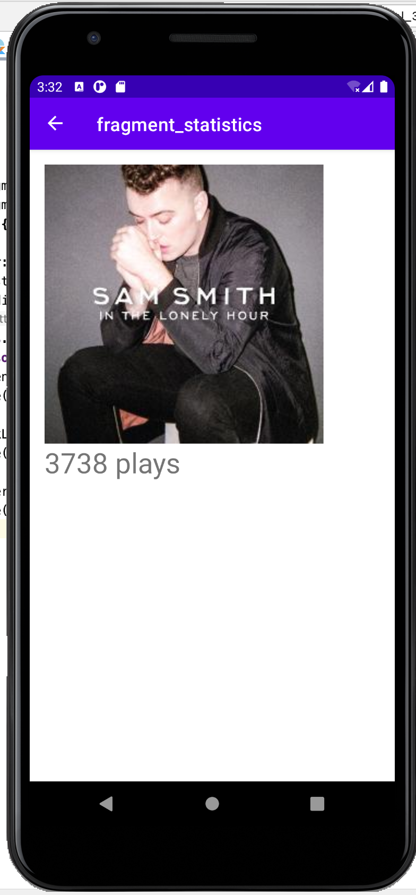

# HW3 - Fragments, Activity Lifecycle, & Rotation
# By Steven Luong
This music app can ...
- Support landscape view of the app
- Play count is preserved when app is switched between various phone orientation
- Used fragments for settings which shows information about the user, play count of song, and app developer

## Extra Credit
I completed these extra credit
- #1 Every Fragment (other than SettingsFragment) has a Up/back button in the top right corner. Clicking
will take you back to the previous fragment

## Screenshots

